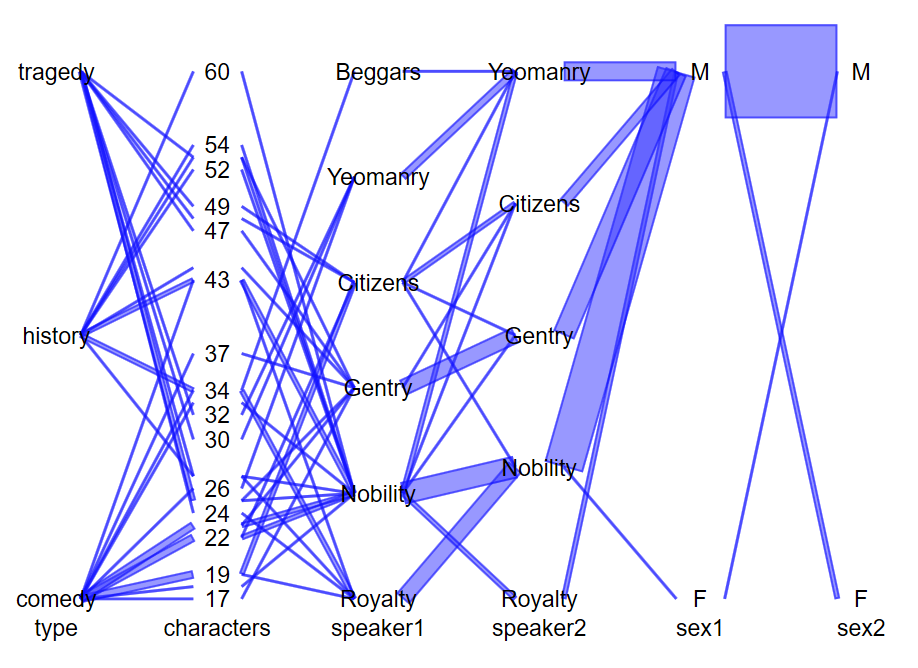
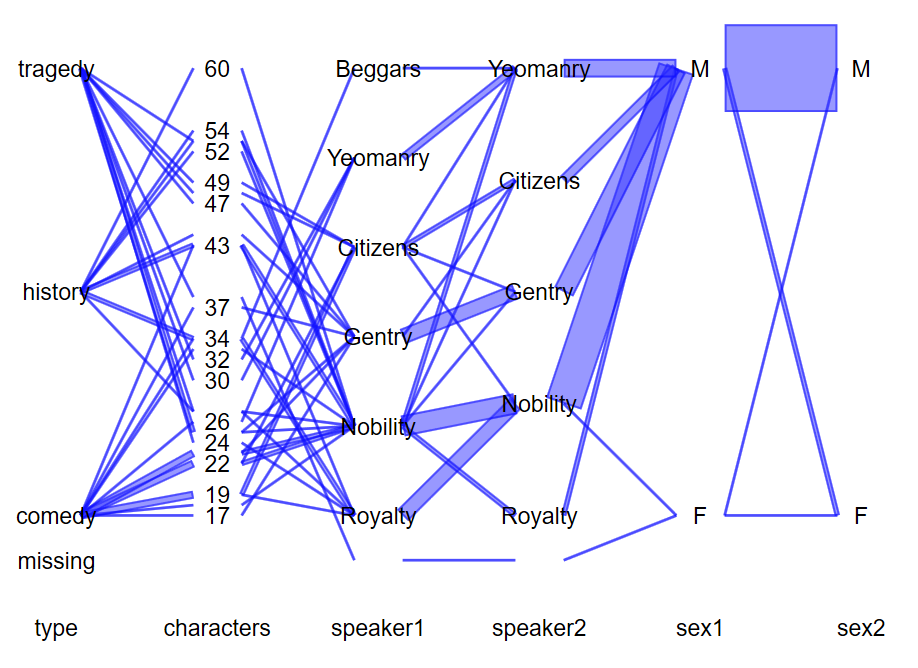
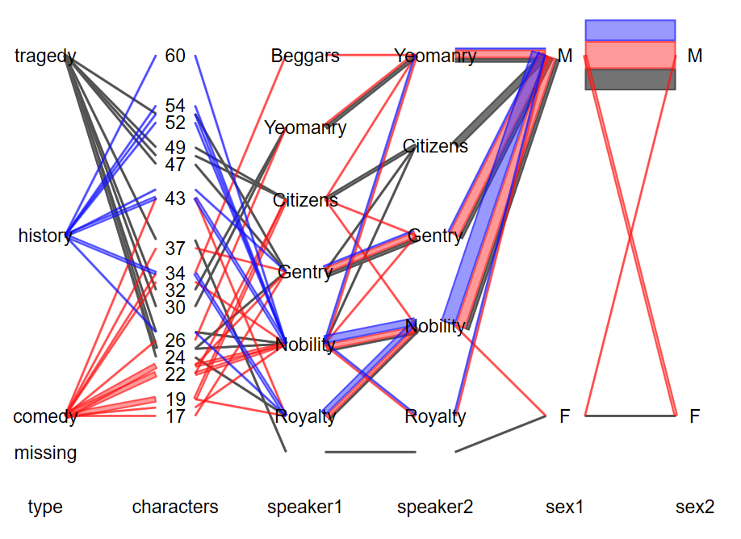
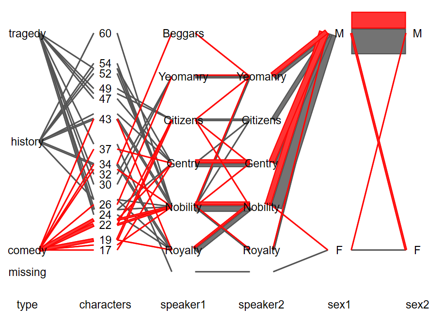
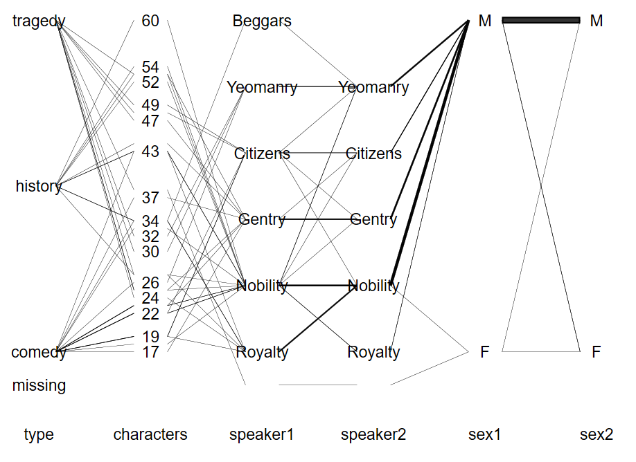
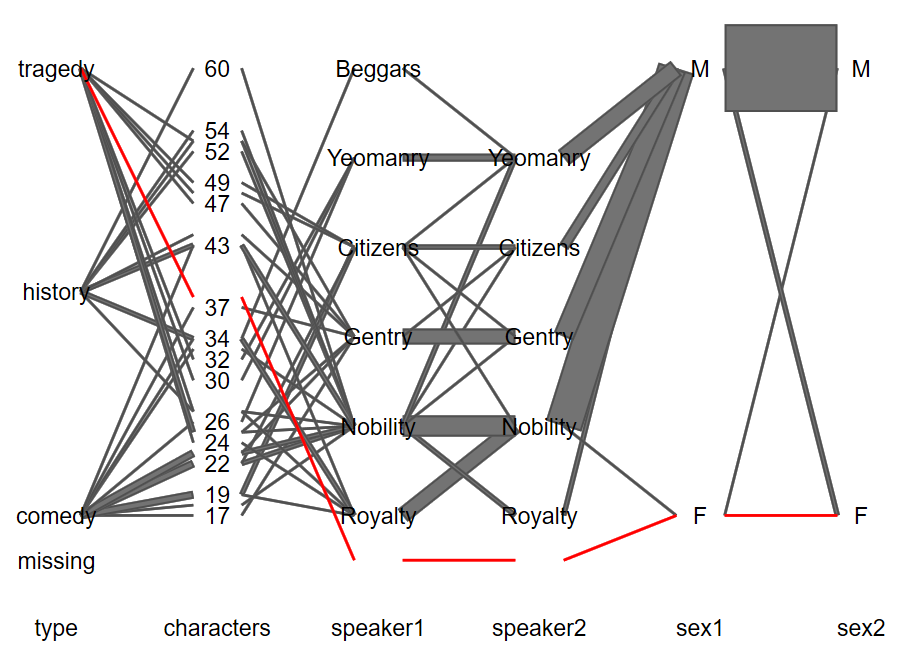
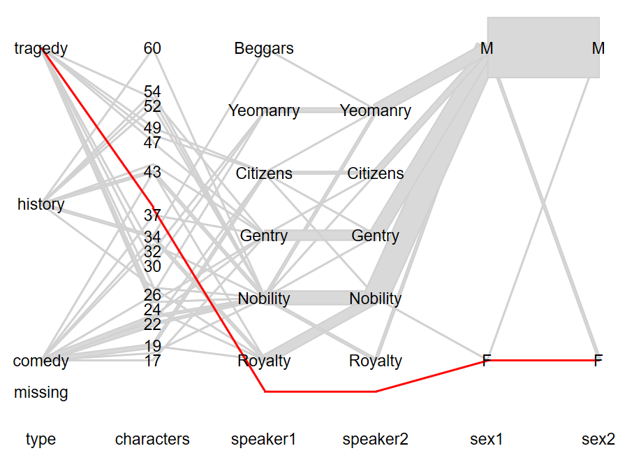
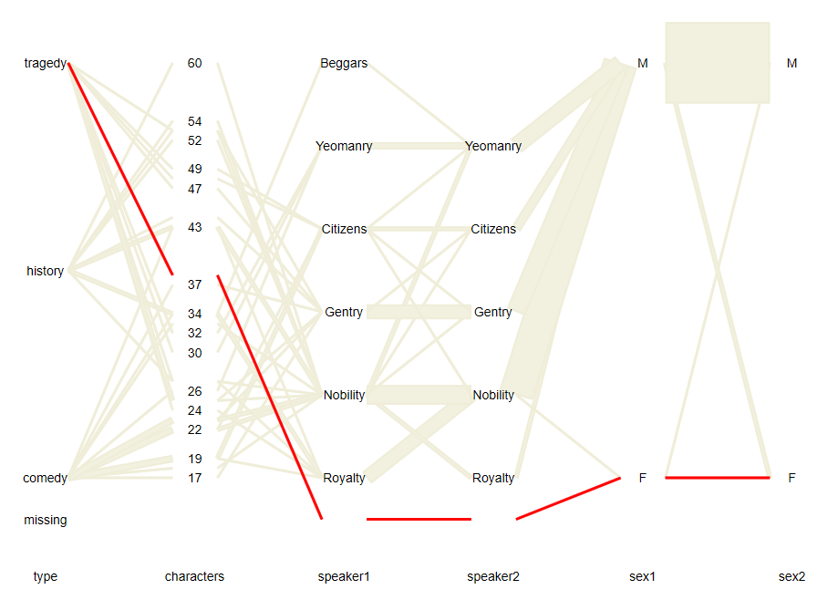

# hammock
Stata implementation of the hammock plot

## Description

    The hammock plot draws a graph to visualize categorical or mixed categorical / continuous data.
    Variables are lined up parallel to the vertical axis. Categories within a variable are spread out along a
    vertical line. Categories of adjacent variables are connected by boxes. (The boxes are rectangles or parallelograms; we
    use boxes for brevity). The "width" of a box is proportional to the number of observations that correspond
    to that box (i.e. have the same values/categories for the two variables). The "width" of a box refers to the
    distance between the longer set of parallel lines rather than the vertical distance.

    If the boxes degenerate to a single line, and no labels or missing values are used the hammock plot
    corresponds to a parallel coordinate plot. Boxes degenerate into a single line if barwidth is so small that
    the boxes for categorical variables appear to be a single line. 

    The order of variables in varlist determines the order of variables in the graph.  All variables in varlist
    must be numerical. String variables should be converted to numerical variables first, e.g. using encode or
    destring.

---

[Getting started](#Getting-started) | [Syntax](#Syntax) | [Examples](#Examples) | [Historical Context](#Historical-Context) | [References](#References)

---


## Getting started

Install hammock from either `ssc` or `GitHub` (may be more recent):

SSC (**v1.25**):

```shell
ssc install hammock, replace
```

GitHub (**v1.25**):

```
net install hammock, from("https://raw.githubusercontent.com/schonlau/hammock-stata/main/installation/") replace
```

If you have the hammock package installed, you can check for updates: `ado update, update`.


## Syntax 

The syntax is as follows:

```
hammock varlist [if] [in],
               [
                Missing BARwidth(real 1) MINBARfreq(int 1) /// 
                hivar(str) HIVALues(numlist  missingokay) SPAce(real 0.0) ///
                LABel labelopt(str) label_min_dist(real 3.0) ///
                SAMEscale(varlist) ///
                ASPECTratio(real 0.72727) COLorlist(str) shape(str) no_outline *
               ]
```

See the help file `help hammock` for details.

The most basic use is as follows:

```
hammock varlist
```

where `varlist` are is the list of variables to visualize in that order.


## Examples

You may want to change the scheme, the overall look of the graph. I prefer a plain white look:

```
set scheme s1color
```

Load the Shakespeare data set to your current directory:
```stata
net get hammock, from("https://raw.githubusercontent.com/schonlau/hammock-stata/main/installation/") replace
```

Each observation in this data set represents one of Shakespeare's plays. 
"speaker1" and "speaker2" refer to the social status of the first two speakers to speak at the beginning of the play. "characters" is the number of different persons in the play.

### First example
In this first example, we add labels and change the background color to a grey tone (gs5) to make the labels more readable:
```
hammock  type characters speaker1 speaker2 sex1 sex2, label color(gs5)
```



### Add missing values 
```
hammock  type characters speaker1 speaker2 sex1 sex2, label color(gs5) missing 
```


### Highlight 
Highlight two values of the "type" variable.
The first color is the default color. 
`red%50` and `blue%50` are highlight colors. `%50` reduces color intensity. 
```
hammock  type characters speaker1 speaker2 sex1 sex2, label  missing ///
   hivar(type) hival(1 2 ) color(gs5 red%50 blue%50 )
```


   
### Use samescale 
Put "speaker1" and "speaker2" on the same scale
```
hammock  type characters speaker1 speaker2 sex1 sex2, label  missing ///
   hivar(type) hival(1) color(gs5 red) ///   
   samescale (speaker1 speaker2)
```

  
### Reduce bar width 
```
hammock  type characters speaker1 speaker2 sex1 sex2, label  missing ///  
   samescale (speaker1 speaker2) barwidth(.1)
```


   
### Highlight missing values
Highlight observations with "speaker1" missing
```
hammock  type characters speaker1 speaker2 sex1 sex2, label  missing ///
   hivar(speaker1) hival(.) color(gs5 red) ///
   samescale (speaker1 speaker2)
```


### Reduce space for labels. 
Labels are shown on top of the boxes. 
To keep the labels readable,  use a lighter grey color for the boxes.
```
hammock  type characters speaker1 speaker2 sex1 sex2, label  missing ///
   hivar(speaker1) hival(.) color(gs13 red) ///
   samescale (speaker1 speaker2) space(-0.02)
```


### Reduce the size of the variable names
Variables names are shown at the bottom.
```
hammock  type characters speaker1 speaker2 sex1 sex2, label  missing ///
   hivar(speaker1) hival(.) color(gs5 red) ///
   samescale (speaker1 speaker2) ///
    xlab(,labsize(vsmall))
```


<!--- comment --->


### Other implementations of the hammock plot 
The Python implementation is called 
[hammock_plot](https://github.com/TianchengY/hammock_plot). It is also downloadable via PyPi.
There is an R implementation as part of the package `ggparallel` 
(The R implementation does not currently allow for quantitative variables).


## Historical context

In 1898, Sankey diagrams were developed to visualize flows of energy and materials. 

In 1985, Inselberg popularized parallel coordinates to visualize continuous variables only. The central contribution is the use of parallel axes.

In 2003, Schonlau proposed the hammock plot. This was the first plot to visualize categorical data (or mixed categorical continuous data) on parallel axes. 

In 2010, Rosvall proposed alluvial plots to visualize network variables over time. Rather than using bars to connect axes, alluvial plots use rounded curves. Alluvial plots are now also used to visualize categorical data.

There are several additional variations that also visualize categorical data including Parallel Set plots (Bendix et al, 2005), Right Angle plots (Hofmann and Vendettuoli, 2013),
and generalized parallel coordinate plots (GPCPs) (popularized by VanderPlas et al., 2023). 

### References 
Bendix, F., Kosara, R., & Hauser, H. (2005). Parallel sets: visual analysis of categorical data. In IEEE Symposium on Information Visualization, 2005. INFOVIS 2005. 133-140. 

Hofmann, H., & Vendettuoli, M. (2013). Common angle plots as perception-true visualizations of categorical associations. IEEE transactions on visualization and computer graphics, 19(12), 2297-2305.

Inselberg, A., & Dimsdale, B. (2009). Parallel coordinates. Human-Machine Interactive Systems, 199-233.

Rosvall, Martin, & Bergstrom, C.T. (2010) "Mapping change in large networks." PloS one 5.1: e8694.

Sankey, H. (1898). Introductory note on the thermal efficiency of steam-engines. report of
the committee appointed on the 31st march, 1896, to consider and report to the council
upon the subject of the definition of a standard or standards of thermal efficiency for
steam-engines: With an introductory note. In Minutes of proceedings of the institution
of civil engineers, Volume 134, pp. 278–283.

Schonlau M. 
*[Visualizing Categorical Data Arising in the Health Sciences Using Hammock Plots.](http://www.schonlau.net/publication/03jsm_hammockplot.pdf)* 
In Proceedings of the Section on Statistical Graphics, American Statistical Association; 2003

VanderPlas, S., Ge, Y., Unwin, A., & Hofmann, H. (2023). 
Penguins Go Parallel: a grammar of graphics framework for generalized parallel coordinate plots. 
Journal of Computational and Graphical Statistics, 1-16. (online first)


